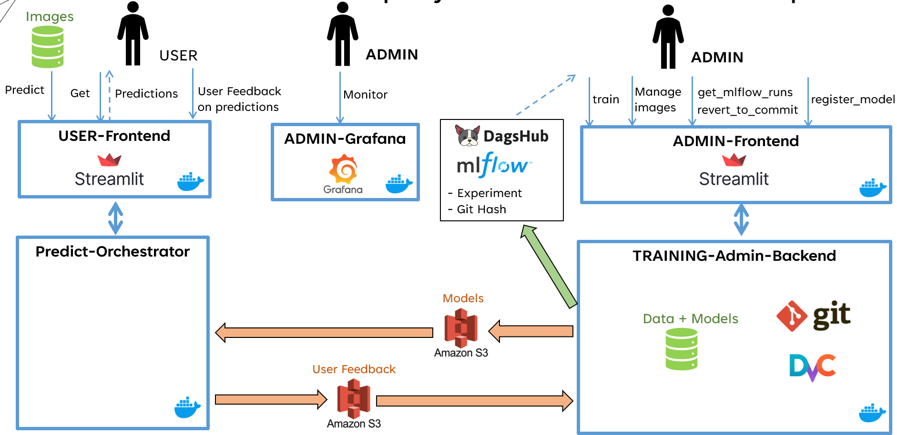
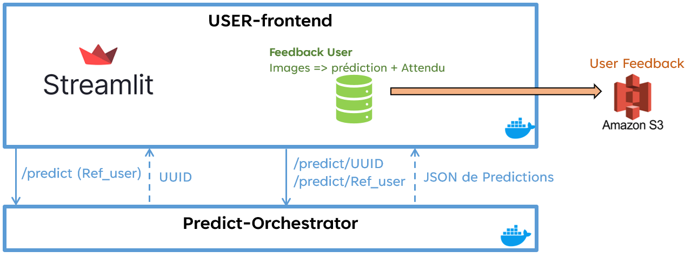
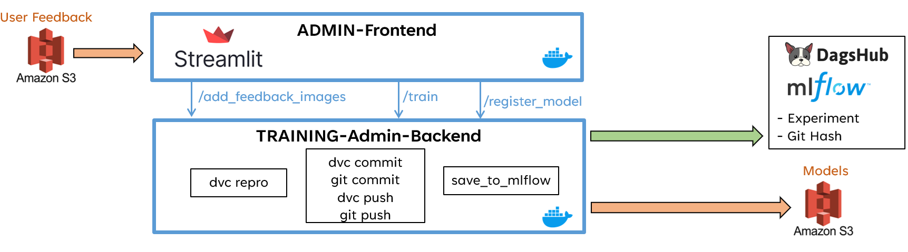
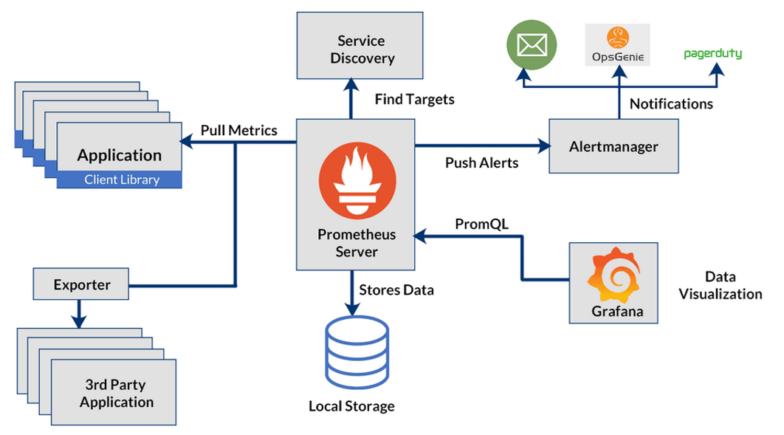
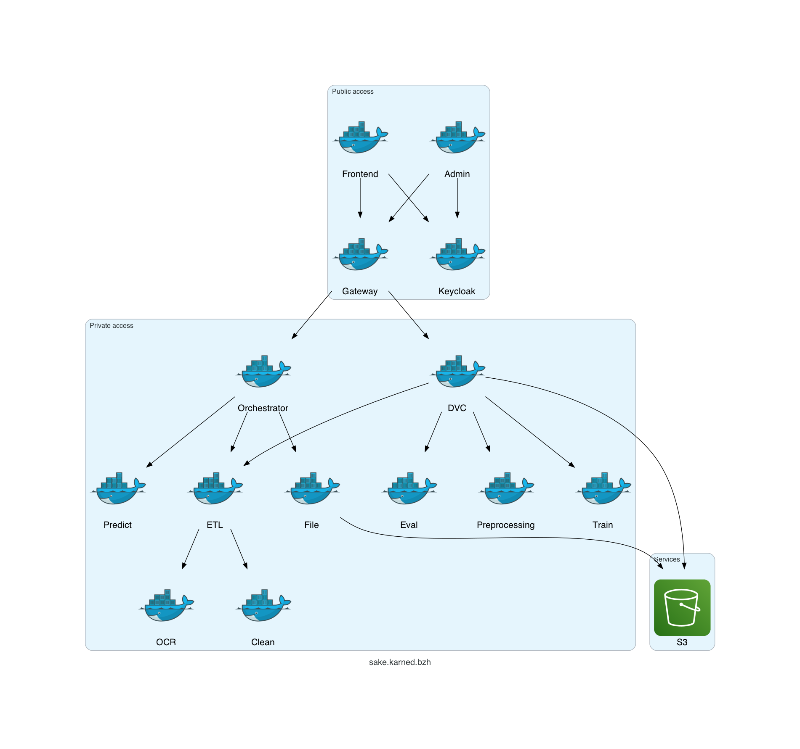

# docker/ folder structure
```
┌──────────────────────────────────────────────────────────────────────────────────────
│ DOCKER definitions
├── docker                      
│   ┌────────────────────────────────────────
│   │ COMMON DOCKERS used in several pipeline
│   ├── etl             Extract Tranform Load (ocerize and clean pictures)
│   │                   Used in Pipeline Training by docker "admin-backend"
│   │                   Used in Pipeline Prediction by docker "orchestrator"
│   ├── clean_text      Clean the ocerized text
│   │                   Used by docker "etl"
│   ├── file            Save data under Amazon S3
│   │                   Used in Pipeline Training by docker "admin-backend"
│   │                   Used in Pipeline Prediction by docker "orchestrator"
│   ┌────────────────────────────────────────
│   │ DOCKERS for the PIPELINE TRAINING
│   ├── admin-frontend  Streamlit Admin frontend
│   ├── admin-backend   Main Docker for the Pipeline Training
│   │                     * Implementing DVC pipeline (dvc repro)
│   │                     * Save data : git/dvc commit/push
│   │                     * MLFlow save experiment
│   │                     * Ability to register a model
│   │                     * Ability to restore another previous experiment
│   ├── preprocessing   Perform the preprocessing of data (vectorize and split)
│   ├── train           Perform the trainig of model
│   ├── eval            Perform the evaluation of model
│   ┌────────────────────────────────────────
│   │ DOCKERS for the PIPELINE PREDICTION
│   ├── frontend        Streamlit User frontend
│   ├── orchestrator    Main Docker for the Pipeline Prediction
│   ├── predict         Perform a prediction with a model
│   ┌────────────────────────────────────────
│   │ DOCKERS for the MONITORING
│   ├── prometheus
│   ├── grafana
│   ├── alertmanager
│   ┌────────────────────────────────────────
│   │ DOCKER for Deployment
│   ├── gateway         Manage interface open to Streamlit User/Admin frontend
└──────────────────────────────────────────────────────────────────────────────────────
```
[Source documentation](../src/README.md) (click to see documentation on /src folder)

# Overview of the Docker architecture


- USER-Frontend = Docker "**frontend**"
- Predict-Orchestrator = Docker "**orchestrator**"
- ADMIN-Grafana = Docker "**grafana**"
- ADMIN-Frontend = Docker "**admin-frontend**"
- TRAINING-Admin-Backend = Docker "**admin-backend**"

See [Business case High Level overview](../docs.md/project_overview_business_cases.md) (click to see the differents steps)

## User Prediction Pipeline (docker architecture)


See [User Prediction Details](../docs.md/User_Prediction_Details.md) (click to see the details)

## User Feedback Management (docker architecture)


See [Prediction Pipeline details](../docs.md/frontend.md) (click to see the details)

## User Feedback Loop (docker architecture)


See [Prediction Pipeline details](../docs.md/frontend.md) (click to see the details)

## Admin Training Pipeline (docker architecture)


See [Admin Training Pipeline Steps](../docs.md/Admin_Training_Pipeline_Steps.md) (click to see the differents steps)

## Admin Monitoring


See [Admin Monitoring Details](../docs.md/Admin_Monitoring_Details.md) (click to see the details)

# Overview of deployed Docker Architecture (using Gateway)

- Admin = Docker "**admin-frontend**"
- DVC = Docker "**admin-backend**"
- clean = Docker "**clean_text**"

See [Deployement Details](../docs.md/Deployement_Details.md) (click to see the details)

