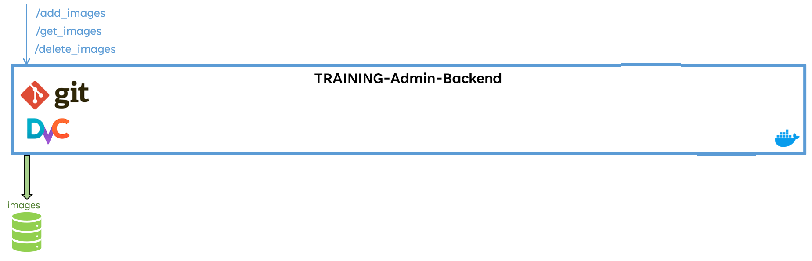
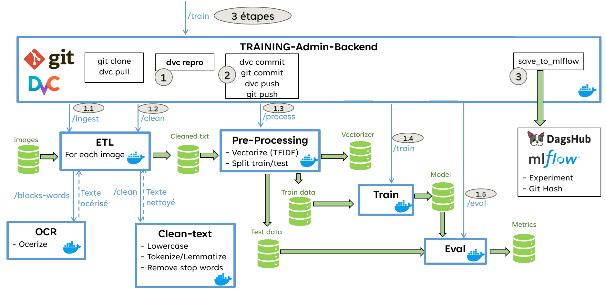
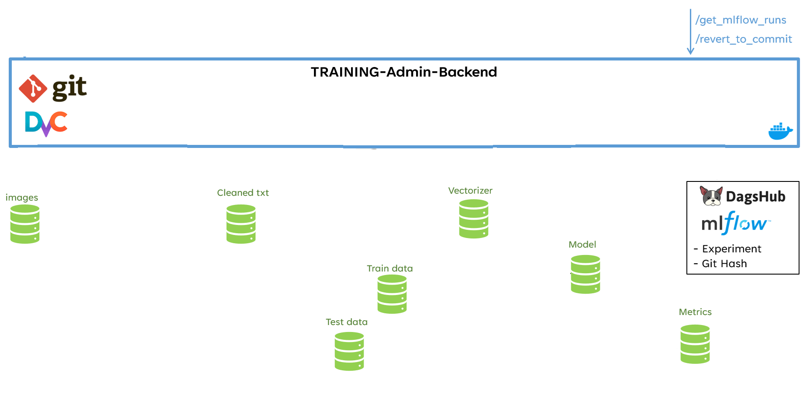
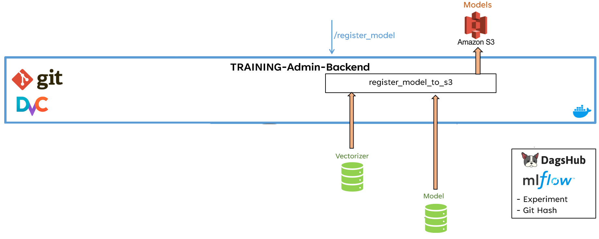

# Step n°0 : l'admin gére les images d'entrainement (add / get / delete)

# Step n°1 : l'admin lance l'entrainement (déclenchement de la pipeline DVC)

# Step n°2 : l'admin analyse les résultats des expériences enregistrée via MLFlow (et restaure éventuellement une ancienne expérience => tout est restauré: images+modèles+metrics)

# Step n°3 : l'admin enregistre le modèle correspondant à l'expérience sélectionnée (éventuellement une ancienne expérience)
