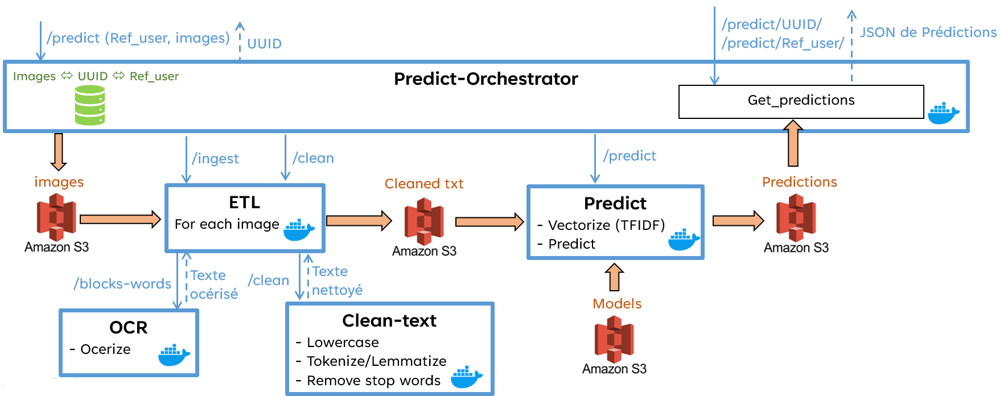

# Overview of Training Pipeline


See [Prediction Pipeline Steps](../docs.md/User_Prediction_Details.md) (click to see the differents steps)


# Run Microservices : API REST
1) Launch **Docker daemon**
    - Linux
        ```sh
        sudo systemctl start docker
        ```
    - Windows : launch **Docker Desktop**

2) Launch **Docker Compose** from the root of the project to launch microservices (Windows or Linux)

    ```sh
    docker-compose --profile prediction up --build -d
    ```
    To access to the frontend of the Prediction please open the following links :
    - User-Prediction-Frontend : http://localhost:8920

    To access to the other dockers through FastAPI, please open the following links :
    - Prediction-Orchestrator : http://localhost:8908/docs
    - ETL : http://localhost:8907/docs
        - OCR : http://localhost:8901/docs
        - Clean_text (remove stop words, small words, etc...) : http://localhost:8903/docs
    - Predict : http://localhost:8909/docs

