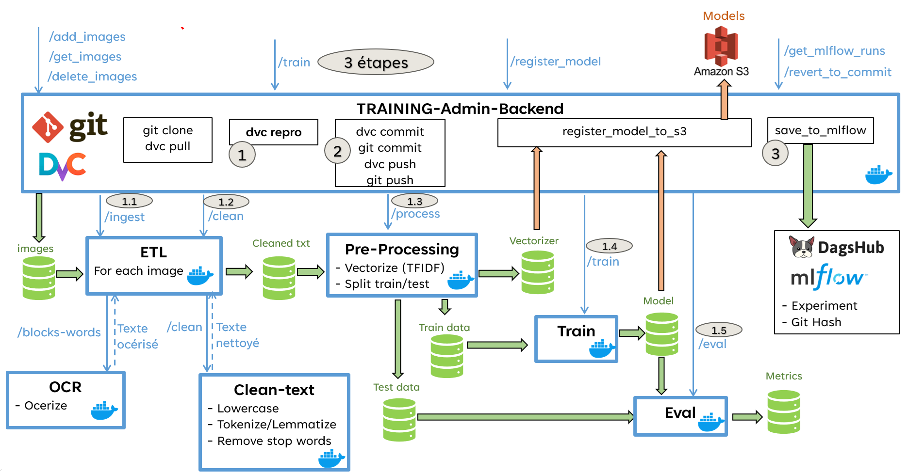

# Overview of Training Pipeline


See [Admin Training Pipeline Steps](../docs.md/Admin_Training_Pipeline_Steps.md) (click to see the differents steps)


# Run Microservices : API REST
1) Launch **Docker daemon**
    - Linux
        ```sh
        sudo systemctl start docker
        ```
    - Windows : launch **Docker Desktop**

2) Launch **Docker Compose** from the root of the project to launch microservices (Windows or Linux)

    ```sh
    docker-compose --profile training up --build -d
    ```
    To access to the frontend of the Training please open the following links :
    - Training-Admin-Frontend : http://localhost:8501

    To access to the other dockers through FastAPI, please open the following links :
    - Training-Admin-Backend : http://localhost:8940/docs
    - ETL : http://localhost:8907/docs
        - OCR : http://localhost:8901/docs
        - Clean_text (remove stop words, small words, etc...) : http://localhost:8903/docs
    - Preprocessing (vectorize): http://localhost:8904/docs
    - Train : http://localhost:8905/docs
    - Eval : http://localhost:8906/docs

# Run Training pipeline

- [OPTIONAL] if you want to run the pipeline from scratch
  1) Remove DVC history  (DVC cache + DVC data folders + DVC lock file)
  2) Get the data from **raw.dvc** (initialize only **data/raw** with the input data of the pipeline)
 
    - Linux
        ```sh
        rm -Rf .dvc/cache .dvc/tmp
        rm -Rf data/raw data/processed data/cleaned 
        rm dvc.lock
        dvc fetch data/raw_per_classes.dvc
        dvc checkout --force
        ```
    - Windows
        ```powershell
        rmdir /S /Q .dvc\cache
        rmdir /S /Q .dvc\tmp
        rmdir /S /Q data\raw 
        rmdir /S /Q data\processed 
        rmdir /S /Q data\cleaned 
        del dvc.lock
        dvc fetch data\raw.dvc
        dvc checkout
        ```

- Run Training pipeline
    ```sh
    dvc repro
    ```


