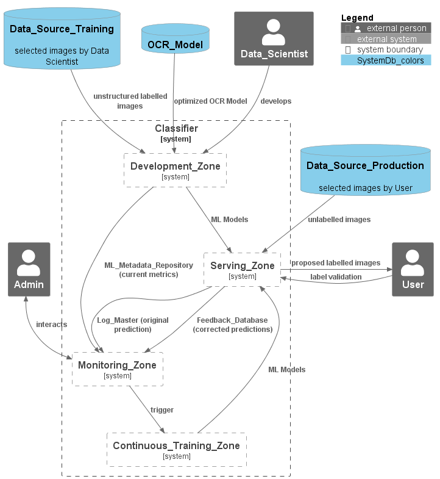

<!-- # The pipelines of the project
## Overview of the project architecture
 -->

## The pipelines used in the different zones

- [Deployement Guide Training Pipeline](Deployement_guide_Training_Pipeline_Local.md) 
