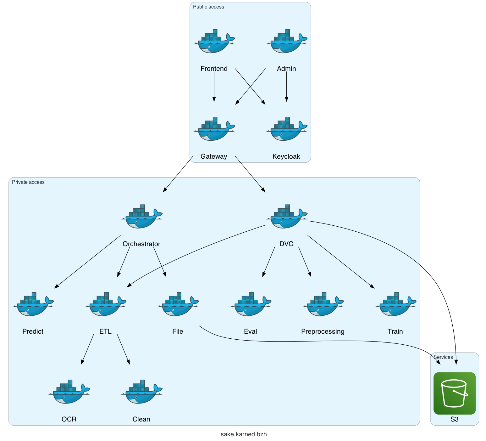

# Overview of deployed Docker Architecture (using Gateway)

- Admin = Docker "**admin-frontend**"
- DVC = Docker "**admin-backend**"
- clean = Docker "**clean_text**"

Detailed documentation
- [Local deployement of Training Pipeline](Deployement_guide_Training_Pipeline_Local.md) 
- [Deployement Details (CI/CD)](../docs.md/Deployement_Details.md) 
