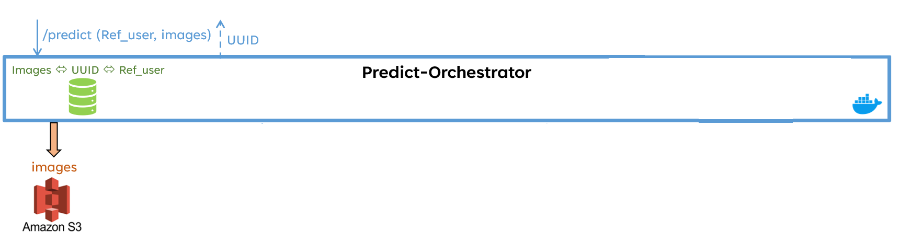
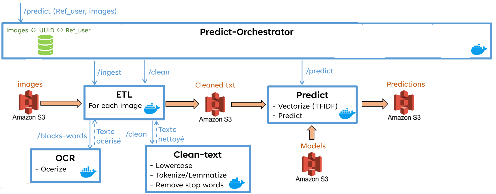
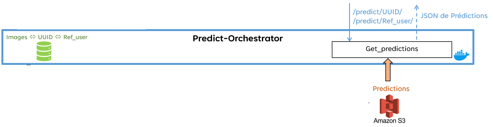

# Step n°1 : l'utilisateur les prédictions en asynchrone (il reçoit un UUID)

# Step n°2 : l'orchestrator lance la pipeline de prédiction en asynchrone (à partir du modèle en cours d'exploitation)

# Step n°3 : l'utilisateur récupére les prédictions en asynchrone (avec le UUID ou sa référence)

