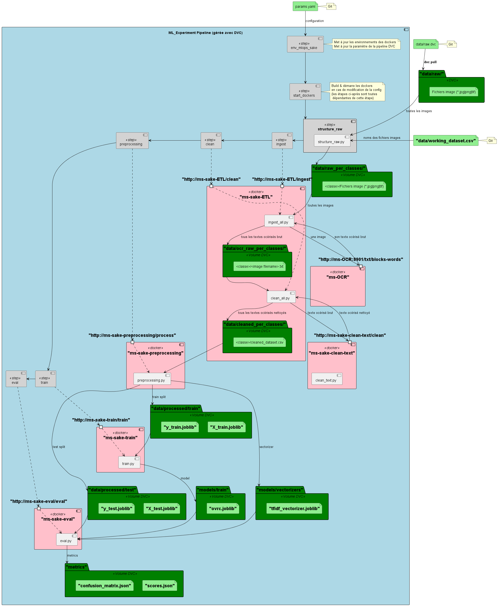
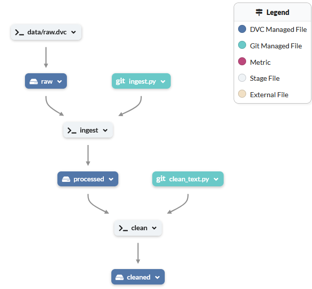

# Overview of ML_Experiment_Pipeline


# Run Microservices : API REST
1) Launch **Docker daemon**
    - Linux
        ```sh
        sudo systemctl start docker
        ```
    - Windows : launch **Docker Desktop**

2) Launch **Docker Compose** from the root of the project to launch microservices (Windows or Linux)

    ```sh
    docker-compose up --build
    ```

    To access to the docker documentationss, please open the following links :
    - OCR : http://localhost:8901/docs
    - clean_text (remove stop words, small words, etc...) : http://localhost:8903/docs
    - PreProcessing (vectorize): http://localhost:8904/docs
    - Training : http://localhost:8905/docs

# Run ML_Experiment_Pipeline

- [OPTIONAL] if you want to run the pipeline from scratch
  1) Remove DVC history  (DVC cache + DVC data folders + DVC lock file)
  2) Get the data from **raw.dvc** (initialize only **data/raw** with the input data of the pipeline)
 
    - Linux
        ```sh
        rm -Rf .dvc/cache .dvc/tmp
        rm -Rf data/raw data/processed data/cleaned 
        rm dvc.lock
        dvc fetch data/raw.dvc
        dvc checkout
        ```
    - Windows
        ```powershell
        rmdir /S /Q .dvc\cache
        rmdir /S /Q .dvc\tmp
        rmdir /S /Q data\raw 
        rmdir /S /Q data\processed 
        rmdir /S /Q data\cleaned 
        del dvc.lock
        dvc fetch data\raw.dvc
        dvc checkout
        ```

- Run ML_Experiment_Pipeline
    ```sh
    dvc repro
    ```




