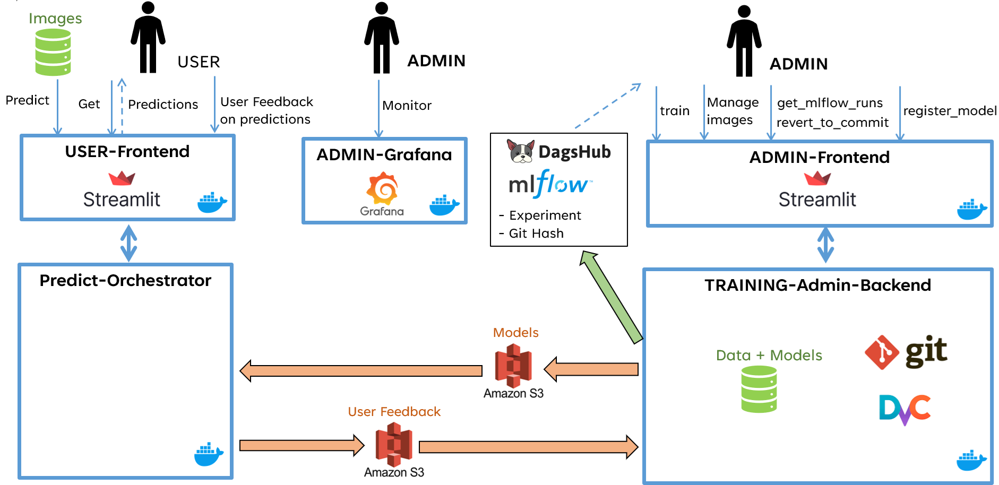

# Description de la problématique adressée
Une agence d'intérim est confrontée quotidiennement à la gestion d'un grand volume de documents divers, notamment dans le cadre des processus de recrutement gérés par le service des Ressources Humaines (RH). Chaque semaine, celui-ci est chargé de recruter environ une centaine de personnes, un processus qui implique la **collecte et le traitement de près d’une vingtaine de documents par candidat**
- **pièces d’identité**
- **justificatifs de domicile**
- **contrats de travail**
- etc...

Ce flux documentaire demande une organisation méticuleuse pour garantir que chaque dossier soit complet, bien structuré et facilement accessible. Le traitement manuel actuel des documents présente plusieurs inconvénients : il est chronophage, sujet à des erreurs humaines, et manque d'efficacité, particulièrement lorsque des recherches rapides dans de grandes bases de données documentaires sont nécessaires. Cette situation finit par créer des goulots d'étranglement.
 
L'objectif du client est **d’automatiser l'identification, la classification et l'indexation de ces documents**. Une telle solution permettrait non seulement de réduire le temps de traitement des dossiers, mais aussi d'en accroître la précision. Chaque document devra être classé selon sa nature (facture, CV, permis de conduire, etc.) et le texte qu'il contient devra être extrait pour permettre une indexation efficace. 

L’application devra également offrir des fonctionnalités permettant aux utilisateurs de **signaler les éventuelles erreurs de classification**. En effet, la solution ne doit pas être statique, mais doit pouvoir évoluer avec le temps grâce à un **mécanisme de correction et de réentraînement** du modèle basé sur les retours des utilisateurs.

# Overview of the project architecture

Le projet vise à répondre à plusieurs problématiques métier  :
- **Classification de documents** : l'application assurera une classification automatique des documents.
- **Monitoring des performances** : l'outil sera doté d'un système de surveillance continue, permettant d'évaluer en temps réel la performance du modèle
- **Réentraînement et redéploiement continu** : un processus automatisé sera mis en place pour réentraîner et redéployer régulièrement le modèle en fonction des nouvelles données.

Deux acteurs principaux:
- **Utilisateurs** : l'application sera principalement utilisée par les employés de l'agence d'intérim. Ils doivent pouvoir interagir avec l'application de manière simple et intuitive, sans avoir besoin de compétences techniques spécialisées.
- **Administrateur** : l'administration de l'application sera assurée par un correspondant de l'entreprise, compétent en outils informatiques, mais sans formation spécifique en data science.

# Overview of the Docker architecture

[Business cases overview](project_overview_business_cases.md) (click to see the differents steps)

[Docker documentation](../docker/README.md) (click to see details)
