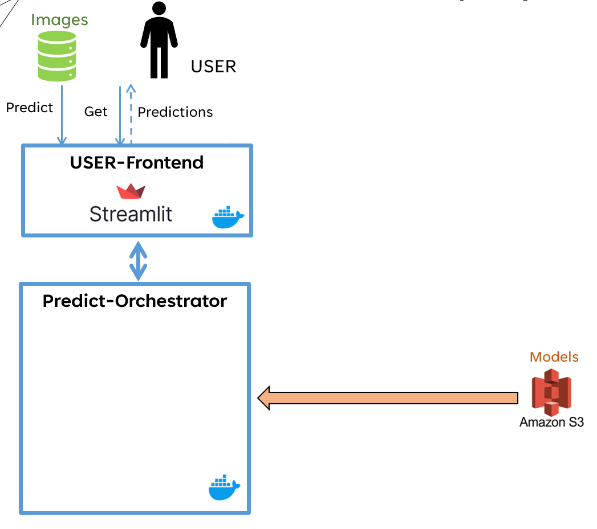
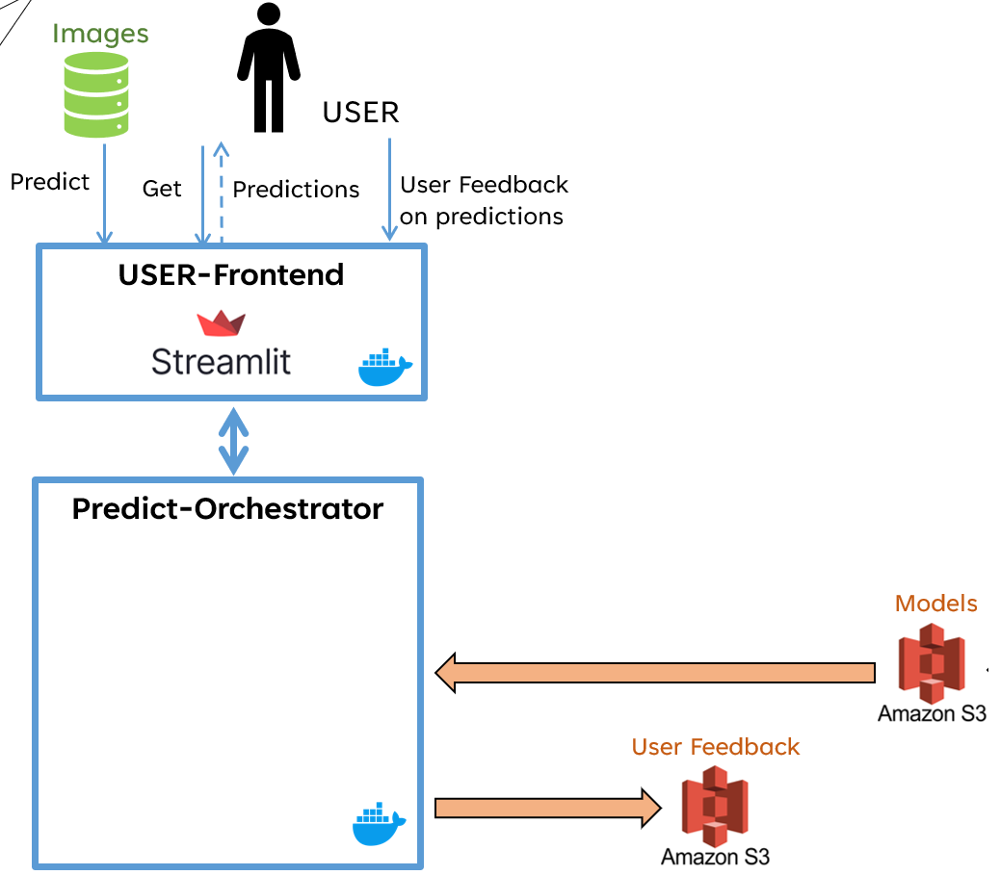
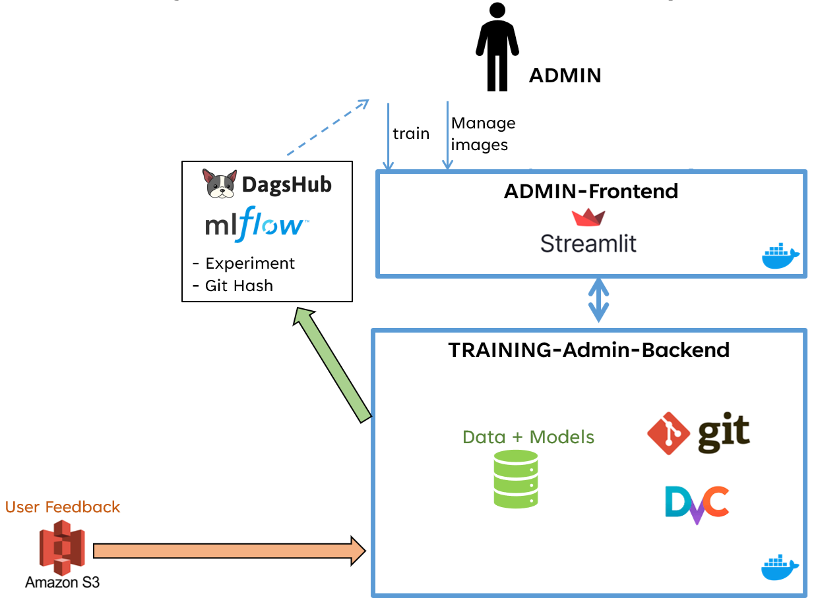
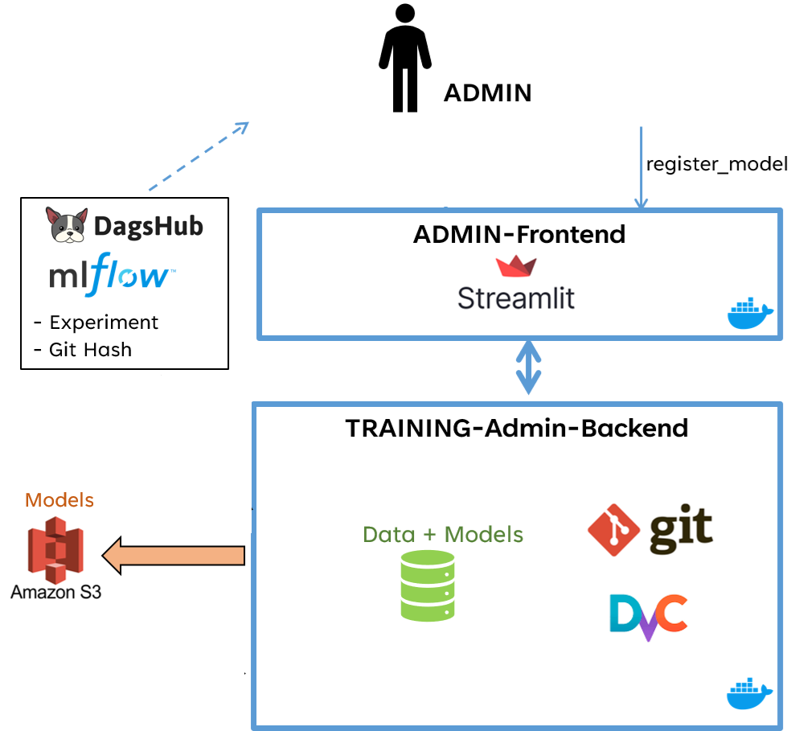
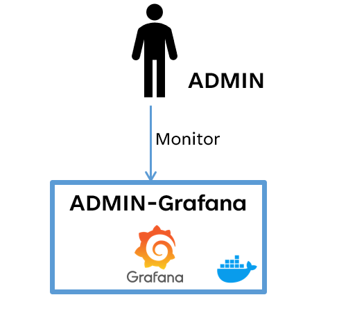

# Step n°1 : l'utilisateur réalise des prédictions

# Step n°1 bis : l'utilisateur donne son feedback (corrections éventuelles)

# Step n°2 : l'admin gère les images d'entrainement (éventuellement en ajoutant feedback user) et lance un entrainement de modèle

# Step n°3 : l'admin analyse les résultats d'expériences et éventuellement restaure une ancienne expérience (images + données intermédiaires + modèles + métriques)

# Step n°4 : l'admin enregistre son modèle préféré (celui qui a éventuellement été restauré)

# En parallèle de toutes ces étapes, l'admin peut surveiller l'état de ses dockers (monitoring)

