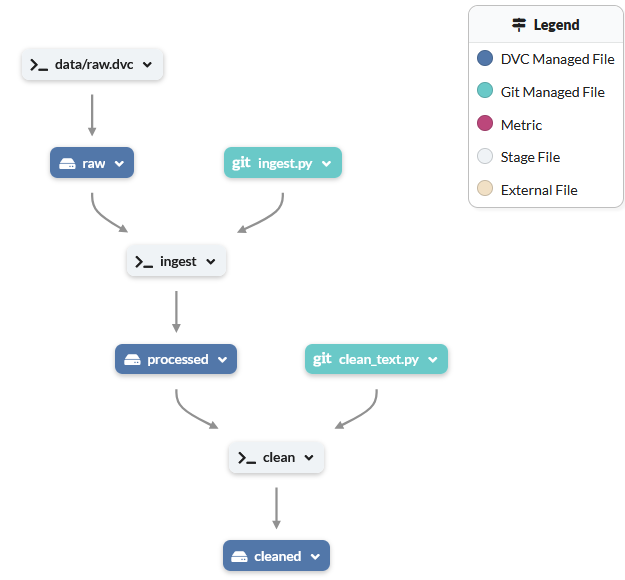

# Lancement des Microservices : API REST
Un fichier Docker Compose à la racine du projet permet de lancer l'ensemble des microservices.

```sh
docker-compose up
```

Pour accéder aux différentes documentations, il suffit de se rendre à l'adresse suivante :
- OCR : http://localhost:8901/docs
- ETL : http://localhost:8903/docs

# Lancement de la pipeline

OPTIONNEL: relancer la pipeline from scratch 
1) en nettoyant les données DVC actuellement uploadée (cache et répertoire data)
2) récupérer les données d'entrées issu de **raw.dvc** (initialise uniqt **data/raw**)
 
Version Linux:
```sh
rm -Rf .dvc/cache .dvc/tmp
rm -Rf data/raw data/processed data/cleaned 
rm dvc.lock
dvc fetch data/raw.dvc
dvc checkout
```
Version windows
```sh
rmdir /S /Q .dvc\cache
rmdir /S /Q .dvc\tmp
rmdir /S /Q data\raw 
rmdir /S /Q data\processed 
rmdir /S /Q data\cleaned 
del dvc.lock
dvc fetch data\raw.dvc
dvc checkout
```

Lancer la pipeline
```sh
dvc repro
```
